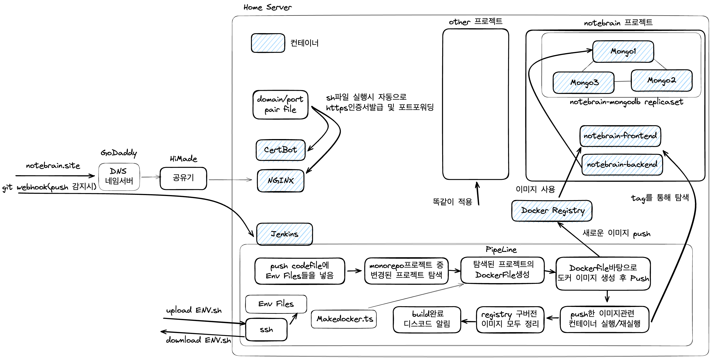

# Private Monorepo

## Home Server

## Projects

### [NoteBrain(마인드맵 생산성 앱)](https://notebrain.site)

- 마인드맵을 그리며 생각을 정리하는 것을 좋아해 개인용으로 쓰기 위해 개발 시작
- 마인드맵의 노드를 그려나갈 수 있으며 노드 안에 내용을 기록할 수 있음(그림 or 텍스트)

1차 개발: **24.2.26-24.3.6**

- 구상했던 마인드맵 생산성 앱 초안 완성
- 모바일 기기 지원
- 색상 커스터마이징 가능

2차 개발: **24.4.22-24.4.26**

- 현재 그림, 텍스트, 마인드맵은 5초에 한 번씩 POST를 하는 구조
  - 변경사항이 있을 때마다 POST를 하도록 변경예정
- 여러 기기에서 한 계정 접속을 하면 서로 동기화가 안되어 꼬임
  - WebSocket을 연결하여 POST가 이뤄지면 나머지 기기에 신호전달
  - 신호를 받으면 GET 수행하여 동기화

현재 구글 SSO 로그인/회원가입만 가능.

특정 구글계정만 로그인/화원가입 가능.
